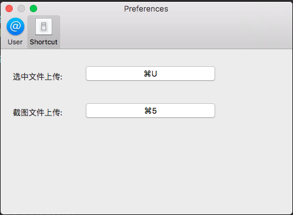
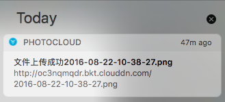

# PhotoCloud 
七牛云图片mac上传工具app,支持选择图片直接上传以及截屏上传，上传成功后返回图片地址

##RELEASE
 [release](https://github.com/liufsd/PhotoCloud/releases)

## TODO

- [x] 配置用户信息界面 
- [x] 支持截屏后上传 
- [x] 支持选中图片后command+u上传图片 
- [x] 上传成功后:
   a.通知栏提示上传成功(可选) 
   b.图片远程地址更新到粘贴板中 
- [ ] 上传管理界面
   a.已经上传的 
   b.正在上传的   
- [x] 图片资源替换
   a.截屏工具栏对勾换成上传
   b.应用程序icon 状态栏icon
- [x] 上传过程中状态栏显示进度      
- [x] 常驻状态栏实现
