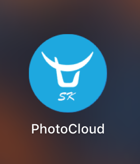
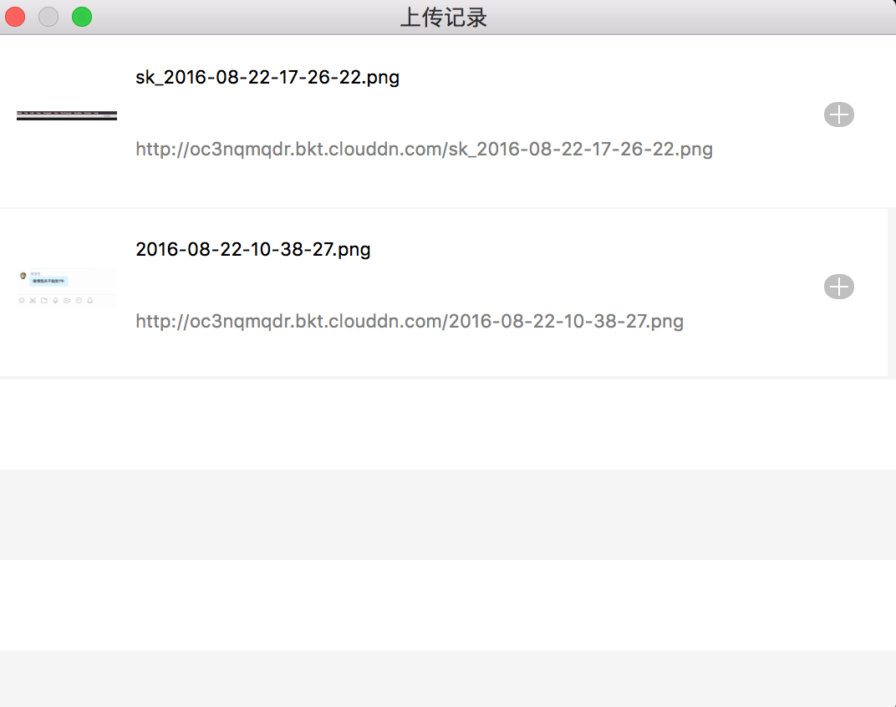

# PhotoCloud (~~~~免费试用&源码开源了的~~~~)
七牛云图片mac上传工具app,支持选择图片直接上传以及截屏上传，上传成功后返回图片地址







## RELEASE
 [release](https://github.com/liufsd/PhotoCloud/releases)

## TODO

- [x] 配置用户信息界面 
- [x] 支持截屏后上传 
- [x] 支持选中图片后command+u上传图片 
- [x] 上传成功后:
   a.通知栏提示上传成功(可选) 
   b.图片远程地址更新到粘贴板中 
- [x] 上传管理界面
- [x] 上传过程中状态栏显示进度      
- [x] 常驻状态栏实现
- [ ] 偏好设置新的tab界面(热键作为单独是一个界面)

	 ```
	 
	   a.开机启动开关
	   
	   b.通知栏是否提示开关
	   
	   c.上传文件加统一的前缀
	 ```
	  
- [ ] 应用自动更新接入实现	  

## About

 一开始并不太想写这个Mac程序，同事经常要写博客需要配图，OK，有人说有chrome插件，但同事反馈的结果是，并不符合程序员的极客精神，更希望的是操作方便。由此就写了这个APP，选择你要上传的图片，然后快捷键command+u,自动帮你上传到你个人的七牛空间并且返回地址到你的粘贴板中，当然也集成了截图自动上传功能，command+5截图,方便写博客的时候配图是自己的代码片段。
